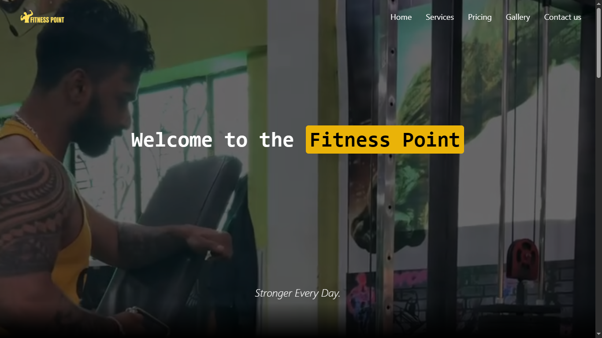
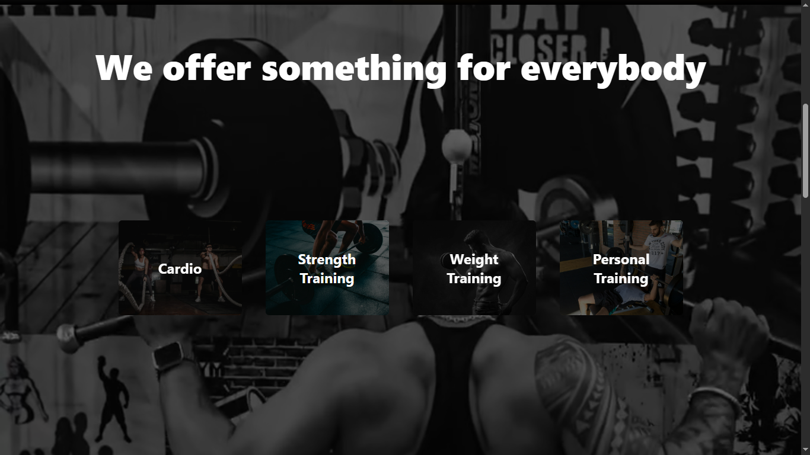
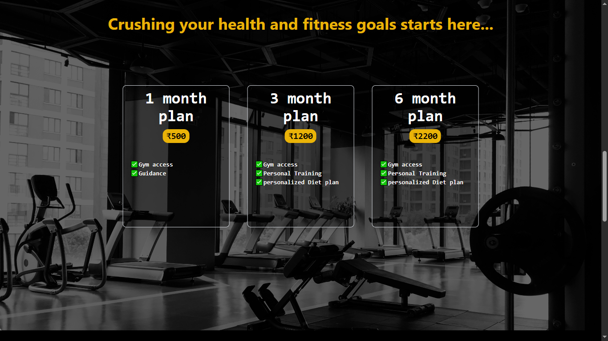
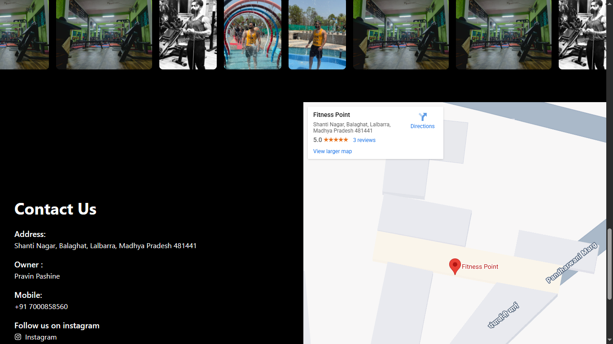

# 🏋️ Gym Website

A responsive and modern gym website built using **React.js** and **Tailwind CSS**. This project showcases a fitness center with sections like a hero banner, pricing plans, gallery, and a contact form with map integration.

## 📸 Home Page

  

## 📸 Services Page

  

## 📸 Pricing Page

  

## 📸 Gallery + Contact Us Page

  

## 🚀 Features

- Responsive design for mobile and desktop
- Hero section with overlay and intro text
- Pricing section with monthly plans
- Auto-scrolling gallery
- Contact section with map and details
- Footer with social links and attribution

## 🔧 Built With

- [React.js](https://reactjs.org/)
- [Tailwind CSS](https://tailwindcss.com/)
- [Google Maps Embed](https://www.google.com/maps)

